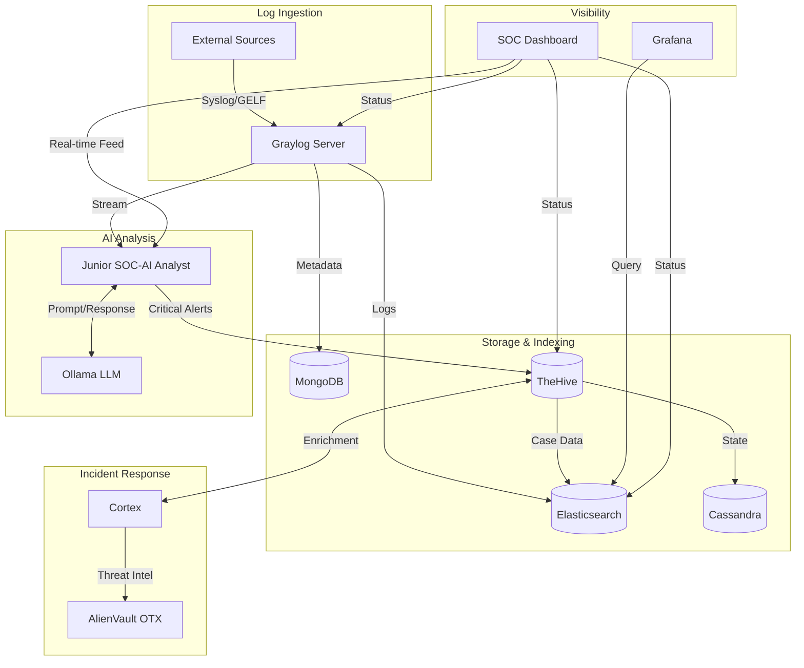

# ⚡ SOC-Lab: Single-File Unified Installer

This repository contains a standalone, self-extracting deployment script for a complete **AI-Powered Security Operations Center (SOC) Lab**. 

With just one Python file, you can deploy a full-stack security pipeline including **Graylog**, **TheHive**, **Cortex**, **Grafana**, and a **Junior AI SOC Analyst** powered by a local LLM (Ollama).

---

## 🏗️ Architecture Overview

The SOC-Lab integrates industry-standard tools into a unified, high-performance security pipeline.

### The Data Flow


### Component Roles:
- **Graylog**: Centralized log management and stream processing.
- **Elasticsearch**: High-speed indexing and search for all security data.
- **TheHive**: Security Incident Response Platform (SIRP) for case management.
- **Cortex**: Analysis and response engine used by TheHive to enrich observables.
- **Grafana**: Advanced visualization and metrics monitoring.
- **Ollama**: Local LLM server running `qwen2.5:1.5b` for 100% private AI analysis.
- **SOC-AI**: Custom Python orchestrator bridging Graylog, Ollama, and TheHive.
- **SOC Dashboard**: A custom "Single Pane of Glass" React/Vue-style interface.

---

## 🚀 Quick Start

### 1. Prerequisites
- **Operating System**: Linux (Ubuntu/Debian recommended) or WSL2.
- **Hardware**: 16GB RAM minimum (for local LLM inference).
- **Software**: Docker, Docker Compose V2, and Python 3.x.

### 2. Deployment
Download the `soc_lab_unified_installer.py` file and run it:

```bash
python3 soc_lab_unified_installer.py
```

### What This Script Does:
1. **Unpacks Architecture**: Extracts the entire project structure (Dockerfiles, application code, and configurations) into the current directory.
2. **Setup Environment**: Generates strong random secrets and creates your local `.env` file automatically.
3. **Orchestrates Stack**: Runs `docker compose up -d --build` to pull images and start all services.
4. **Automates Config**: Configures Graylog's Syslog UDP input via API so it's ready for logs immediately.

---

## 🔑 Post-Deployment (Mandatory)

Once the installer finishes, you need to generate API keys to link the services together.

### 1. Get API Keys
1. **Cortex**: Go to `http://localhost:9002`, create an admin, and generate an API key in the user profile.
2. **TheHive**: Go to `http://localhost:9001`, create an Org/User, and generate an API key.

### 2. Update Environment
Open the generated `.env` file and paste the keys into:
- `CORTEX_API_KEY`
- `THEHIVE_API_KEY`

### 3. Apply Changes (The Surgical Way)
To avoid restarting the entire stack, apply your keys only to the affected services:

```bash
# Update ONLY the AI service after adding keys
docker compose up -d soc-ai

# If you need to rebuild the AI's Python environment:
docker compose up -d --build soc-ai

# Update TheHive (after adding Cortex API key):
docker compose up -d thehive
```

---

## 🖥️ Access Your Lab
- **SOC Dashboard**: `http://localhost:8080` (Live AI feed & health checks)
- **Graylog**: `http://localhost:9000` (admin/admin)
- **TheHive**: `http://localhost:9001`
- **Grafana**: `http://localhost:3000` (admin/admin)
- **Cortex**: `http://localhost:9002`

---

## 🔒 Security Note
All keys and passwords are either generated randomly at runtime or use generic placeholders that you update manually.

## UI


*Created using Antigravity AI.*


